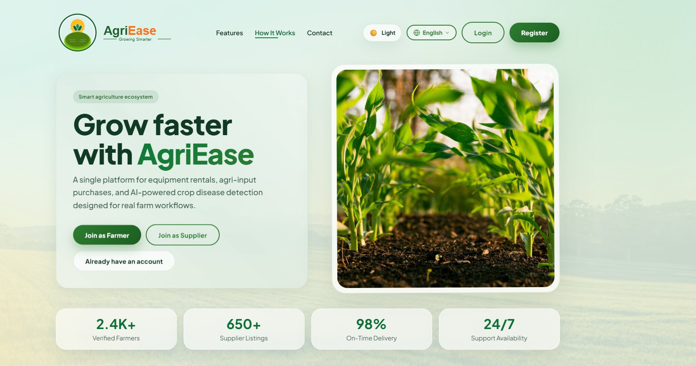
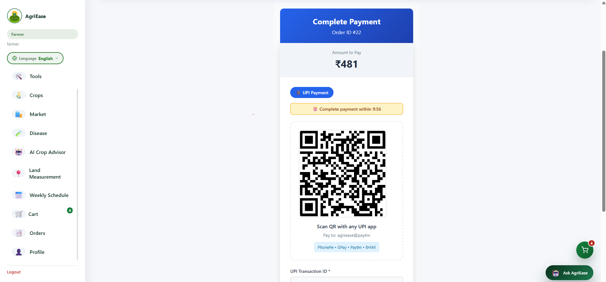

<div align="center">

# 🌱 AgriEase
### AI-Powered Smart Agriculture Platform

Empowering Farmers with Smart Technology through Artificial Intelligence, Full Stack Development, and Secure Digital Solutions.


</div>

---

# 📖 Overview

AgriEase is a Full Stack Smart Agriculture Platform that integrates Artificial Intelligence with modern web technologies to simplify farming operations.

The platform enables farmers to:

- 🌾 Detect plant diseases using AI
- 🛒 Buy and sell agricultural products
- 🚜 Rent farming equipment
- 🌦 Access real-time weather information
- 💳 Make secure online payments
- 🔐 Use role-based secure authentication

Built using **React, Spring Boot, PostgreSQL, Flask AI, and JWT Authentication**, AgriEase aims to digitally transform agriculture with an intuitive and scalable platform.

---

# 🎯 Problem Statement

Farmers often rely on multiple disconnected platforms for:

- Crop disease diagnosis
- Weather updates
- Equipment rental
- Buying fertilizers and seeds
- Selling crops
- Order management

AgriEase brings all these services together into one secure and user-friendly platform.

---

# ✨ Key Features

## 👨‍🌾 Farmer Module

- Secure Registration & Login
- JWT Authentication
- Farmer Dashboard
- Marketplace
- Equipment Rental
- Order Tracking
- Profile Management
- Weather Updates

---

## 🛒 Marketplace

- Buy Seeds
- Buy Fertilizers
- Buy Agricultural Products
- Shopping Cart
- Product Search
- Category Filtering
- Order History

---

## 🚜 Equipment Rental

- Browse Equipment
- Book Equipment
- Rental Request Management
- Equipment Availability

---

## 🤖 AI Plant Disease Detection

- Upload Plant Images
- CNN-Based Disease Prediction
- Disease Information
- Suggested Treatments
- Flask AI Integration

---

## 💳 Payment System

- Razorpay Integration
- Secure Payments
- Order Confirmation
- Payment Tracking

---

## 🔐 Authentication

- JWT Authentication
- Role-Based Authorization
- Secure Login
- Protected APIs

---

# 🏗 System Architecture

```text
                 React Frontend
                       │
                 REST API Calls
                       │
             Spring Boot Backend
                       │
          JWT Authentication Layer
                       │
             PostgreSQL Database
                       │
          Flask AI Prediction Model
                       │
            Disease Prediction Result
```

---

# 🛠 Tech Stack

## Frontend

- React.js
- JavaScript
- HTML5
- CSS3
- Axios

---

## Backend

- Java 17
- Spring Boot
- Spring Security
- REST APIs

---

## Database

- PostgreSQL

---

## AI Module

- Python
- Flask
- CNN Model

---

## Authentication

- JWT Authentication

---

## Payment Gateway

- Razorpay

---

## Tools

- Git
- GitHub
- Postman
- VS Code
- IntelliJ IDEA

---

# 📂 Project Structure

```text
AgriEase/
│
├── frontend/
│   ├── src/
│   ├── public/
│   └── package.json
│
├── backend/
│   ├── src/
│   ├── pom.xml
│   └── application.properties
│
├── flask-ai/
│   ├── app.py
│   ├── model/
│   └── requirements.txt
│
├── database/
│   └── schema.sql
│
├── screenshots/
│   ├── banner.png
│   ├── login.png
│   ├── dashboard.png
│   ├── marketplace.png
│   ├── disease-detection.png
│   ├── equipment.png
│   ├── payment.png
│   └── profile.png
│
├── README.md
├── LICENSE
└── .gitignore
```

---

# 📷 Application Screenshots

## 🌟 Project Banner

<p align="center">

</p>

---

## 🔐 Login Page

<p align="center">

</p>

---

## 🏠 Home Page

<p align="center">

</p>

---

## 📊 Farmer Dashboard

<p align="center">

</p>

---

## 🛒 Marketplace

<p align="center">

</p>

---

## 🚜 Equipment Rental

<p align="center">

</p>

---

## 🤖 AI Disease Detection

<p align="center">

</p>

---

## 💳 Payment Gateway

<p align="center">

</p>

---

## 👤 User Profile

<p align="center">

</p>

---

# 🔄 Application Workflow

```text
User
   │
   ▼
React Frontend
   │
REST API Requests
   │
Spring Boot Backend
   │
JWT Authentication
   │
PostgreSQL Database
   │
Flask AI Model
   │
Prediction Result
```

---

# 🔌 API Modules

### Authentication

- POST /api/auth/register
- POST /api/auth/login

### Marketplace

- GET /api/products
- POST /api/products
- GET /api/categories

### Orders

- GET /api/orders
- POST /api/orders

### Equipment

- GET /api/equipment
- POST /api/equipment

### AI Disease Detection

- POST /predict

---

# 🗄 Database

The PostgreSQL database stores:

- Users
- Roles
- Products
- Categories
- Orders
- Cart
- Equipment
- Payments
- Disease Predictions

---

# 🚀 Installation

## Clone Repository

```bash
git clone https://github.com/rohankathole-svg/AgriEase-A-Smart-Agriculture-Platform.git
```

---

## Backend

```bash
cd backend
mvn clean install
mvn spring-boot:run
```

---

## Frontend

```bash
cd frontend
npm install
npm run dev
```

---

## AI Server

```bash
cd flask-ai
pip install -r requirements.txt
python app.py
```

---

# 🎯 Learning Outcomes

This project helped strengthen my skills in:

- Full Stack Development
- Spring Boot
- React.js
- REST API Development
- JWT Authentication
- PostgreSQL
- Database Design
- AI Integration
- Payment Gateway Integration
- Git & GitHub
- Software Architecture

---

# 🚀 Future Enhancements

- Voice Assistant for Farmers
- AI Crop Recommendation
- Government Scheme Recommendation
- Live Market Prices
- IoT Integration
- Push Notifications
- Multi-language Support
- Mobile Application

---

# 🤝 Contributors

**Rohan Kathole**

Software Engineer | Full Stack Developer

GitHub: https://github.com/rohankathole-svg

LinkedIn: https://www.linkedin.com/in/rohan-kathole

Email: rohankathole07@gmail.com

---

# 📜 License

This project is licensed under the **MIT License**.

---

<div align="center">

### ⭐ If you found this project useful, please consider giving it a Star!

Made with ❤️ by **Rohan Kathole**

</div>
