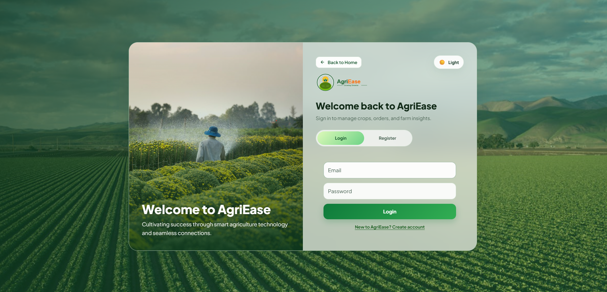
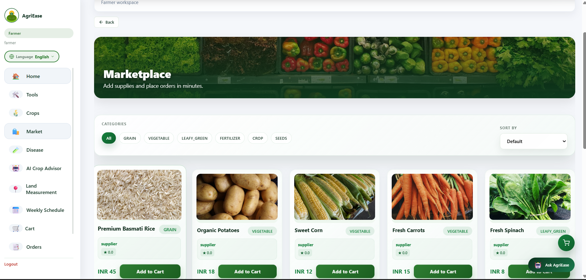

# 🌱 AgriEase – AI-Powered Smart Agriculture Platform

<div align="center">

### 🚜 Empowering Farmers with Smart Technology

*A Full-Stack Smart Agriculture Platform that combines AI, Marketplace, Equipment Rental, Weather Insights, and Secure Authentication to simplify modern farming.*


</div>

---

# 📖 Overview

AgriEase is a **Full-Stack Smart Agriculture Platform** designed to help farmers access essential agricultural services through a single digital platform.

The application combines **Spring Boot**, **React**, **PostgreSQL**, and **Artificial Intelligence** to provide secure authentication, an online agricultural marketplace, equipment rental, weather updates, crop disease diagnosis, and online payments.

The goal of AgriEase is to bridge the gap between traditional farming practices and modern digital technology.

---

# 🎯 Problem Statement

Farmers often rely on multiple disconnected platforms for:

- Crop disease diagnosis
- Weather information
- Equipment rental
- Buying fertilizers & seeds
- Selling agricultural products

AgriEase brings all these services together into one secure and user-friendly platform.

---

# ✨ Features

## 👨‍🌾 Farmer Module

- Secure Registration & Login
- JWT Authentication
- Dashboard
- Marketplace
- Equipment Rental
- Order Tracking
- Crop Disease Detection
- Weather Information
- Profile Management

---

## 🛒 Marketplace

- Buy Seeds
- Buy Fertilizers
- Buy Agricultural Products
- Shopping Cart
- Order Management
- Product Search & Filtering

---

## 🚜 Equipment Rental

- Browse Equipment
- Rent Agricultural Equipment
- Rental Requests
- Booking Management

---

## 🤖 AI Plant Disease Detection

- Upload Plant Image
- CNN-Based Disease Prediction
- Disease Information
- Suggested Treatment
- Flask AI Integration

---

## 🌦 Weather Information

- Real-time Weather Updates
- Temperature
- Humidity
- Farming Insights

---

## 💳 Payment Module

- Razorpay Payment Gateway
- Secure Online Payments
- Order Confirmation

---

## 🔐 Authentication

- JWT Authentication
- Role-Based Authorization
- Secure Login
- Protected APIs

---

# 🏗 System Architecture

```
                React Frontend
                      │
                REST API Calls
                      │
          Spring Boot Backend
                      │
       JWT Authentication Layer
                      │
      PostgreSQL Database
                      │
          Flask AI Service
```

---

# 🛠 Tech Stack

## Frontend

- React.js
- JavaScript
- HTML5
- CSS3
- Axios

---

## Backend

- Java 17
- Spring Boot
- Spring Security
- REST APIs

---

## Database

- PostgreSQL

---

## Authentication

- JWT Authentication

---

## AI Module

- Python
- Flask
- CNN Model

---

## Payment Gateway

- Razorpay

---

## Tools & Technologies

- Git
- GitHub
- Postman
- VS Code
- IntelliJ IDEA

---

# 📂 Project Structure

```
AgriEase/
│
├── frontend/
│
├── backend/
│
├── flask-ai/
│
├── database/
│
├── screenshots/
│
├── docs/
│
└── README.md
```

---

# 📷 Application Screenshots

## Landing Page


### Login



---

### Dashboard


---

### Marketplace



---

### Disease Detection


---

### Equipment Rental


---

# 🚀 Installation

## Clone Repository

```bash
git clone https://github.com/rohankathole-svg/AgriEase-AI-Smart-Agriculture-Platform.git
```

---

## Backend

```bash
cd backend

mvn spring-boot:run
```

---

## Frontend

```bash
cd frontend

npm install

npm run dev
```

---

## AI Server

```bash
cd flask-ai

pip install -r requirements.txt

python app.py
```

---

# 🎯 Learning Outcomes

This project helped strengthen my knowledge in:

- Full Stack Development
- Spring Boot
- React.js
- REST API Development
- JWT Authentication
- PostgreSQL
- Database Design
- AI Integration
- Payment Gateway Integration
- Git & GitHub

---

# 🔮 Future Enhancements

- Voice Assistant
- Multi-language Support
- AI Crop Recommendation
- Government Scheme Recommendation
- IoT Sensor Integration
- Push Notifications
- Farmer Community Forum

---

# 🤝 Contributing

Contributions, suggestions, and feedback are always welcome.

Feel free to fork this repository and submit pull requests.

---

# 👨‍💻 Author

## Rohan Kathole

**Software Engineer | Full Stack Developer**

📧 Email: rohankathole07@gmail.com

💼 LinkedIn:
https://www.linkedin.com/in/rohan-kathole

💻 GitHub:
https://github.com/rohankathole-svg

---

# ⭐ Support

If you found this project useful,

⭐ **Please consider giving it a Star!**

It helps motivate future development and improvements.

---

## 📜 License

This project is licensed under the **MIT License**.
